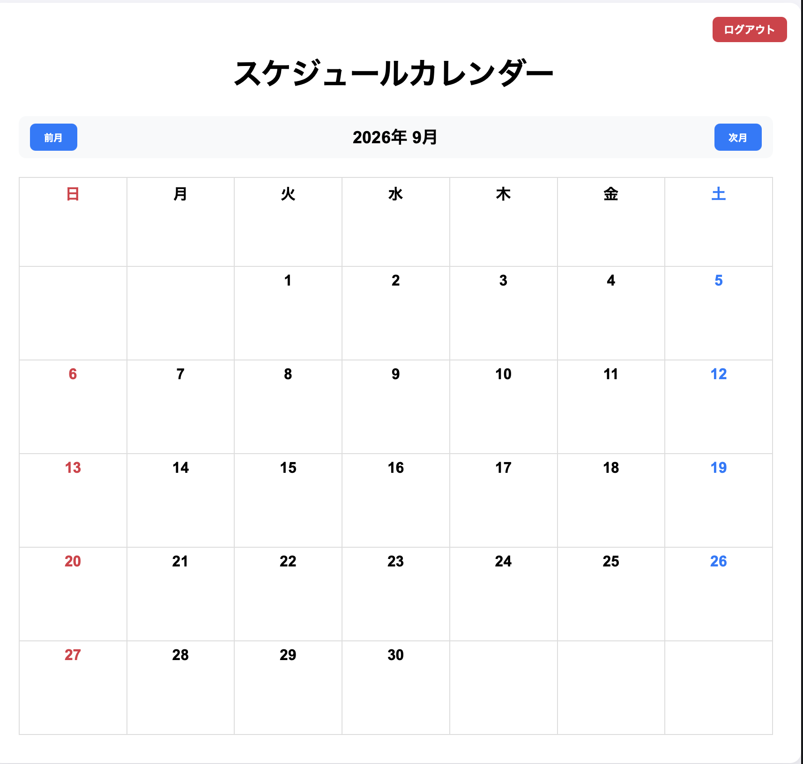
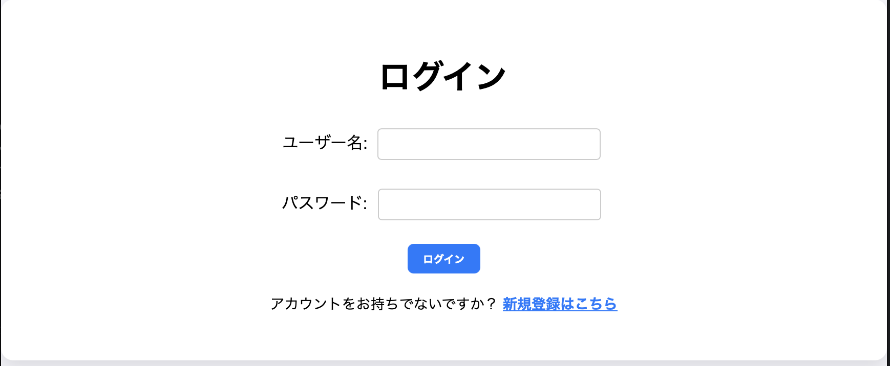
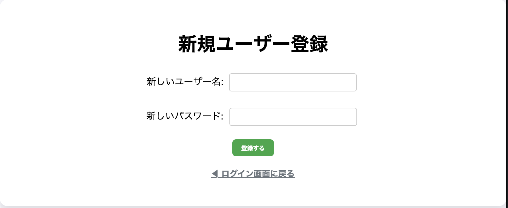
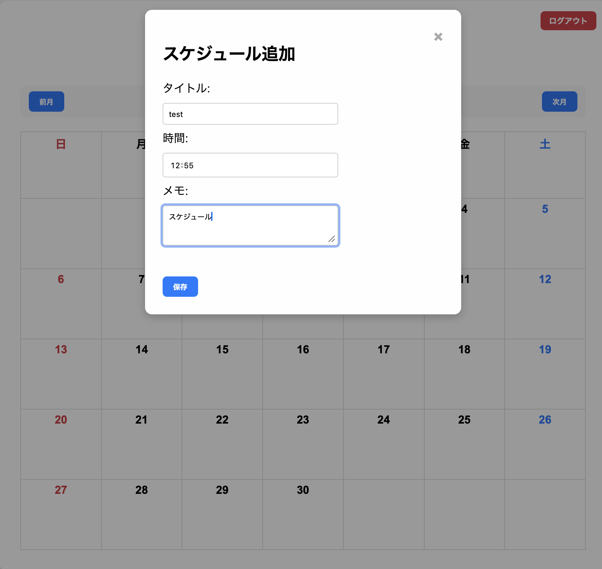
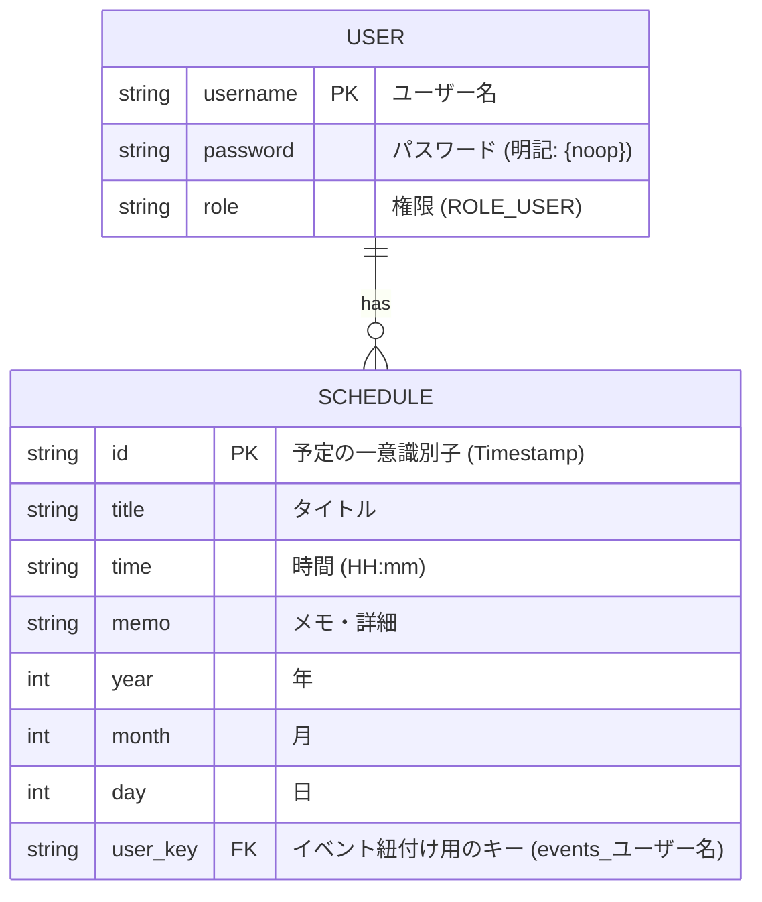

# アカウント別スケジュール管理カレンダーアプリ (Calendar App)

Spring Boot 3.x と Spring Security を採用した、堅牢でモダンな**アカウント別スケジュール管理カレンダーアプリ**です。
独自のログイン認証と新規ユーザー登録機能を備え、ブラウザの LocalStorage を活用して**ログイン中のユーザーごとに予定が完全に隔離・保存される**プライベートカレンダーシステムを構築しています。

---





---
##  主な機能

-  **セキュアな認証システム**: Spring Security による強固なログイン・ログアウト制御。
-  **ユーザー新規登録＆重複チェック**: 画面遷移のないスマートな新規登録フォーム。既存ユーザー名の重複を自動で検知し、赤文字で注意警告を表示。
-  **アカウント別のデータ完全隔離**: LocalStorage の保存キーにログインユーザー名を動的に結合。別アカウントの予定は 1 ミリも閲覧・削除できないプライバシー保護仕様。
-  **サイズ完全固定レイアウト**: `table-layout: fixed` により、どれだけ長い予定の文章を入力してもカレンダーの枠線（マスの横幅・縦幅）が絶対に崩れない堅牢な CSS 設計。
-  **文字あふれ防止（...省略化）**: 長い文字の予定は自動的に右端で切り詰められ、美しい `...` 表記に変換。
-  **予定の個別ピンポイント削除**: 日付マスのクリックイベント（追加モーダル）と競合しないよう、イベントの伝播（`stopPropagation`）を完全に制御した即時削除ボタンを搭載。

---

##  使用技術・動作環境

- **バックエンド**: Java 21 / Spring Boot 3.x / Maven
- **セキュリティ**: Spring Security (InMemoryUserDetailsManager による動的ユーザー追加)
- **フロントエンド**: Thymeleaf / HTML5 / CSS3 (Flexbox, Grid) / JavaScript (Vanilla JS)
- **データ保存**: Web Storage (LocalStorage)

---

##  起動・実行方法

本アプリは、IntelliJ などの開発環境がないパソコンでも、Java がインストールされていれば以下の手順で誰でも一瞬で起動できます。

### 配布用パッケージの構成
```text
配布用フォルダ/
 ├─ calendar-app-new-0.0.1-SNAPSHOT.jar （アプリ本体）
 ├─ カレンダー起動.command              （Mac用自動起動スイッチ）
 └─ カレンダー起動.bat                  （Windows用自動起動スイッチ）
```

###  Macでの起動手順
1. 初回のみ、ターミナルを開いて以下のコマンドを実行し、アクセス権限を許可します。
   ```bash
   chmod +x /path/to/カレンダー起動.command
   ```
2. `カレンダー起動.command` をダブルクリックします。
3. 自動的に Safari などのブラウザが立ち上がり、`http://localhost:8085/login` が開きます。

###  Windowsでの起動手順
1. `カレンダー起動.bat` をダブルクリックします。
2. 自動的に Edge や Chrome が立ち上がり、`http://localhost:8085/login` が開きます。

---

##  システム設計

### 1. API仕様（ルーティング一覧表）

| リクエストURL | メソッド | 機能・役割 | アクセス権限 | 画面遷移 / 返却値 |
| :--- | :--- | :--- | :--- | :--- |
| `/login` | `GET` | ログイン / 新規登録画面の表示 | 全員アクセス可 (`permitAll`) | `login` (HTML文字列) |
| `/login` | `POST` | Spring Securityによるログイン認証処理 | 全員アクセス可 (`permitAll`) | 成功: `/calendar` / 失敗: `/login?error` |
| `/register` | `POST` | 新規ユーザー登録＆重複チェック処理 | 全員アクセス可 (`permitAll`) | 成功: `/login?regSuccess` / 重複: `/login?regError` |
| `/calendar` | `GET` | メインのカレンダー画面を表示 | **要ログイン** (`authenticated`) | `calendar` (HTML文字列) |
| `/logout` | `POST` | ログアウト処理（ユーザー情報のクリア） | **要ログイン** (`authenticated`) | `/login?logout` |

### 2. データ構造とER図（Entity Relationship Diagram）

将来的なリレーショナルデータベース（RDB）化を見据えた、本アプリの論理データ構造の設計図です。



---

##  ライセンス・セキュリティ確認

- 本プロジェクトのソースコードには、公開されて危険な個人情報、本名、外部接続用の私的なパスワード等は一切含まれていません。
- パブリックなポートフォリオとして安全に公開・再利用が可能です。
